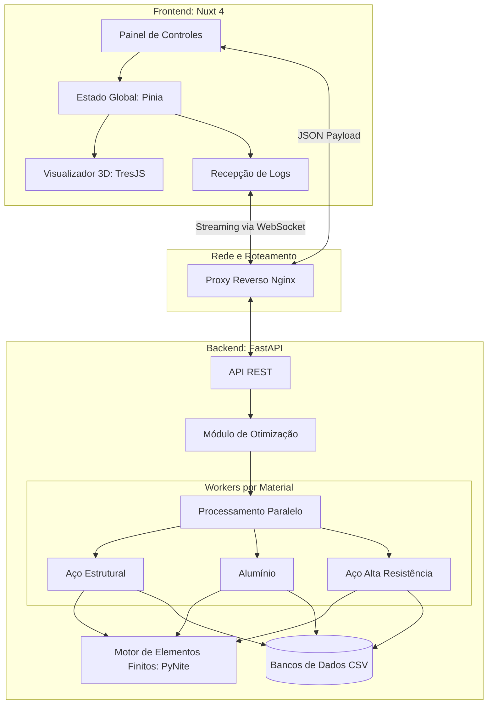
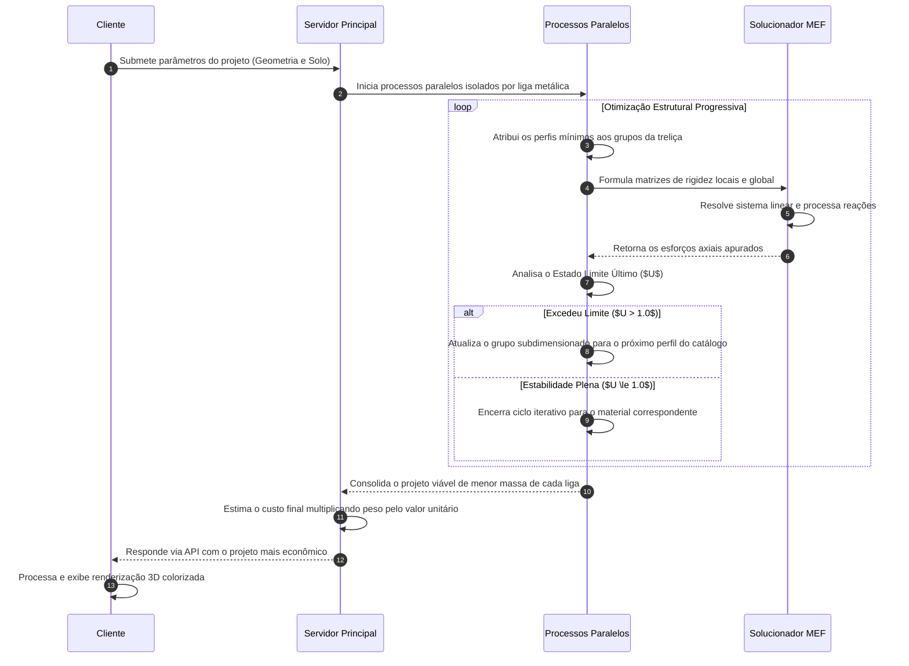

# TRUSS-OPT 3D: Sistema Computacional para Dimensionamento e Otimização Paramétrica de Treliças Espaciais

> **Instituição:** Universidade Estadual Vale do Acaraú (UVA)
> 
> **Curso:** Bacharelado em Engenharia Civil
> 
> **Disciplina:** Métodos Numéricos
> 
> **Autor:** Paulo Raí Lopes de Melo
> 
> **Professor:** Prof. Audelis Marcelo
> 
> **Período:** 2026.1

## 1. Visão Geral do Software

O **TRUSS-OPT 3D** (Truss Optimizer 3D, ou Otimizador de Treliças 3D) é um sistema computacional desenvolvido para calcular, dimensionar e otimizar estruturas metálicas do tipo treliça espacial. A partir da definição geométrica e dos carregamentos pelo usuário, o software executa análises estruturais sucessivas para encontrar a combinação de perfis metálicos que atenda aos requisitos normativos de segurança (NBR 8800) com o menor peso e custo de fabricação possível.

O dimensionamento tradicional de estruturas reticuladas frequentemente envolve um processo manual e iterativo de verificação de perfis comerciais, o que demanda tempo e pode resultar em estruturas superdimensionadas. Para solucionar esse problema, o TRUSS-OPT 3D automatiza o ciclo de dimensionamento, mesclando fundamentos de cálculo estrutural, métodos numéricos avançados e desenvolvimento de software.

A plataforma utiliza algoritmos de busca e multiprocessamento para analisar catálogos reais de materiais, como aço e alumínio. A cada iteração, o sistema examina os esforços axiais por meio do Método dos Elementos Finitos (MEF) e verifica a instabilidade elástica. O resultado final entregue ao usuário é um projeto estrutural tecnicamente viável, que garante uma excelente relação de custo-benefício, respeitando as exigências técnicas vigentes.

## 2. Funcionalidades da Plataforma

A interface da plataforma foi projetada para oferecer controle preciso sobre a modelagem estrutural. A seguir, detalham-se as principais operações que o usuário pode realizar no software:

### 2.1. Modelagem Paramétrica e Topologias

- **Seleção de Tipologias Estruturais:** É possível gerar modelos instantaneamente a partir de configurações pré-programadas:
  - _Coberturas:_ Tesouras Pratt, Howe e Fink.
  - _Pontes:_ Modelos de ponte Warren e Pratt.
  - _Torres:_ Torres autoportantes de seção quadrada ou triangular.
  - _Balanços:_ Estruturas engastadas (marquises) nos padrões Pratt e Warren.
- **Controle Geométrico 3D:** O usuário pode ajustar continuamente as dimensões globais da treliça:
  - **Vão Livre ($L$):** Distância longitudinal entre os apoios.
  - **Altura ($H$):** Altura máxima do pórtico ou flecha da cobertura.
  - **Largura Transversal ($W$):** Profundidade tridimensional da estrutura. Caso o valor inserido seja zero, o software realiza uma análise bidimensional plana.
  - **Largura do Topo:** Recurso exclusivo para torres, permitindo a redução da seção transversal na parte superior para a criação de geometrias tronco-piramidais.
- **Discretização da Malha:**
  - **Número de Painéis/Divisões:** Ajuste da quantidade de subdivisões longitudinais. Isso redistribui automaticamente os nós, montantes e diagonais, alterando o comprimento livre de flambagem de cada elemento.
  - **Número de Seções (Torres):** Controle da quantidade de módulos verticais na montagem de torres de transmissão ou suporte.

### 2.2. Condições de Contorno e Interação Geotécnica

- **Carregamento Externo:** O sistema permite a inserção da carga total de projeto em quilogramas-força (kgf). Essa carga é rateada e aplicada automaticamente de forma nodal ao longo do banzo superior da estrutura.
- **Cálculo de Peso Próprio:** Durante a otimização, o software contabiliza automaticamente o peso dinâmico de cada peça metálica e o converte em cargas gravitacionais nos nós correspondentes.
- **Interação Solo-Estrutura (ISE):**
  - **Seleção de Perfil de Solo:** O usuário pode selecionar o tipo de fundação a partir de um catálogo integrado (Rocha, Areia Fofa, Areia Compacta, Argila Mole e Argila Rija).
  - **Coeficiente Personalizado:** Permite a entrada manual do coeficiente de reação do subleito ($k_{s1}$), caso dados específicos de sondagem de solo estejam disponíveis.
  - **Geometria da Sapata:** É possível informar as dimensões da base ($B$) e do comprimento ($L$) da fundação isolada. O sistema utiliza essas medidas para corrigir os recalques previstos e calcular as constantes das molas elásticas verticais e rotacionais.

### 2.3. Visualização 3D e Inspeção de Dados

- **Renderização Espacial Interativa:** O modelo calculado é exibido em um ambiente 3D interativo, no qual o usuário pode rotacionar, aproximar e investigar os detalhes geométricos, incluindo os contraventamentos transversais.
- **Mapa de Cores para Tensões:**
  - Barras na cor **Vermelha** indicam membros submetidos à compressão axial.
  - Barras na cor **Azul** indicam membros sob tração axial.
  - Barras **Cinzas** representam elementos inativos ou com esforços irrelevantes.
- **Inspeção Detalhada por Peça:** Ao clicar em qualquer barra do modelo renderizado, um painel lateral exibe dados específicos daquele elemento:
  - Força axial atuante (em kN).
  - Perfil comercial atribuído pelo algoritmo (ex.: tubo quadrado 100x100x5.0).
  - Taxa de Utilização ($U$), indicando o nível de solicitação da peça frente à sua resistência nominal.
  - Tipo de esforço predominante.

### 2.4. Feedback de Otimização e Resultados

- **Alertas de Inconsistência:** O sistema emite alertas preventivos caso as dimensões propostas gerem esbeltezes excessivas ou relações geométricas inviáveis.
- **Acompanhamento de Processamento:** Durante o cálculo, o usuário visualiza na tela o registro (log) de testes em tempo real, podendo observar quais materiais estão sendo avaliados e quais perfis foram descartados por não atenderem às normas.
- **Resumo Econômico:** Ao final do processamento, a plataforma exibe o material que resultou no melhor custo-benefício, o peso total da treliça otimizada (em kg) e o custo estimado para a aquisição do material estrutural.

## 3. Arquitetura de Software e Tecnologias Adotadas

A plataforma adota uma arquitetura orientada a serviços, separando o gerenciamento da interface do usuário da carga de processamento numérico, o que confere maior robustez e escalabilidade.

### 3.1. Servidor de Cálculo Numérico (Backend)

- **Linguagem e Framework:** O backend é desenvolvido em Python 3.11+, operando sobre o framework web assíncrono FastAPI. A validação estruturada das requisições e a modelagem de dados são asseguradas pela biblioteca Pydantic.
- **Solver Estrutural:** O cálculo dos deslocamentos nodais e reações de apoio é executado por meio da biblioteca PyNite FEA, especializada na formulação matricial de pórticos e treliças 3D.
- **Otimização Concorrente:** Para reduzir significativamente o tempo de processamento, a arquitetura emprega o módulo `multiprocessing` do Python. Isso permite que diferentes ligas metálicas (como aço padrão e alumínio) sejam testadas simultaneamente em núcleos físicos distintos do processador do servidor.
- **Comunicação Assíncrona:** A transmissão dos logs de progresso do servidor para o cliente ocorre através de conexões WebSocket.
- **Gerenciamento de Recursos:** O código possui rotinas internas (via biblioteca `psutil`) que encerram precocemente o processamento caso a matriz gerada demande mais de 90% da memória RAM disponível, evitando falhas críticas no sistema operacional.

### 3.2. Interface e Renderização (Frontend)

- **Framework Web:** O cliente atua como uma _Single Page Application_ (SPA) construída em Nuxt 4 e Vue.js 3, empregando a _Composition API_ para proporcionar transições fluidas e estado reativo.
- **Gerenciamento de Estado:** A biblioteca Pinia é utilizada para centralizar as variáveis geométricas e as configurações de carregamento, fornecendo um fluxo de dados limpo para os componentes de visualização.
- **Renderizador 3D:** A exibição espacial da treliça é delegada à biblioteca TresJS, que funciona como um encapsulador declarativo e reativo para o motor WebGL Three.js.
- **Design de Interface:** O estilo visual foi construído sobre a estrutura CSS Tailwind, assegurando a adaptação automática do layout tanto para monitores convencionais quanto para dispositivos móveis.

### 3.3. Diagrama de Arquitetura



## 4. Fundamentação Teórica e Modelagem Estrutural

O núcleo analítico do software é balizado pelos preceitos da mecânica dos sólidos, métodos matriciais e engenharia geotécnica.

### 4.1. Método dos Elementos Finitos (MEF)

A análise trata a estrutura como um sistema reticulado elástico linear. As hipóteses fundamentais incluem ligações perfeitamente rotuladas, de forma que os membros suportam exclusivamente cargas axiais e não transmitem momentos fletores.
Cada nó dispõe de três graus de liberdade operacionais ($D_x, D_y, D_z$). A rigidez de uma barra é função direta de sua seção transversal ($A$), módulo de elasticidade longitudinal ($E$) e comprimento ($L$).
A contribuição das rigidezes locais de todas as barras compõe a matriz de rigidez global da estrutura $[K]$. O problema é solucionado resolvendo-se o sistema linear:
$$\{F\} = [K] \cdot \{D\}$$
Onde $\{F\}$ é o vetor das forças aplicadas e $\{D\}$ é o vetor de deslocamentos nodais resultantes.

### 4.2. Verificações Normativas (NBR 8800)

Para dimensionar os perfis e assegurar estabilidade, o sistema avalia o Estado Limite Último (ELU). A variável principal é a Taxa de Utilização ($U$), correspondente à razão entre a solicitação de cálculo ($N_{Ed}$) e a capacidade resistente ($N_{Rd}$). A aprovação estrutural exige que $U \le 1.0$ para todas as barras.

#### Esforço de Tração Axial

Em elementos tracionados ($N_t > 0$), a capacidade é determinada pelo escoamento da seção transversal bruta:
$$N_{t,Rd} = A \cdot f_y$$
Onde $f_y$ é a tensão de escoamento característica da liga metálica.

#### Esforço de Compressão e Instabilidade

Em membros sob compressão ($N_c < 0$), a resistência é frequentemente governada pela flambagem elástica global. A capacidade resistente é calculada com a adoção de um fator de redução normativo $\chi$:
$$N_{c,Rd} = \chi \cdot A \cdot f_y$$
Para o cálculo de $\chi$, determina-se inicialmente a carga crítica de Euler ($N_e$) e o respectivo índice de esbeltez reduzida ($\lambda_0$):
$$N_e = \frac{\pi^2 \cdot E \cdot I}{L^2}$$
$$\lambda_0 = \sqrt{\frac{A \cdot f_y}{N_e}}$$
As expressões normativas definem o fator de redução como se segue:

- Se $\lambda_0 \le 1.5$: $\chi = 0.658^{\lambda_0^2}$
- Se $\lambda_0 > 1.5$: $\chi = \frac{0.877}{\lambda_0^2}$

### 4.3. Interação Solo-Estrutura (Apoios Elásticos)

A abordagem computacional tradicional considera apoios indeslocáveis, o que mascara os efeitos dos recalques. O software implementa o Modelo de Winkler para simular bases deformáveis.
O coeficiente de reação do subleito extraído de testes padronizados ($k_{s1}$) é devidamente corrigido para refletir as dimensões físicas da sapata de fundação ($B$), embasado nas proposições de Terzaghi:

- **Para solos granulares (areias):** $k_s = k_{s1} \cdot \left( \frac{B + 0.305}{2B} \right)^2$
- **Para solos coesivos (argilas):** $k_s = k_{s1} \cdot \left( \frac{0.305}{B} \right)$

Com o coeficiente corrigido, são atribuídas molas computacionais aos nós apoiados, possuindo as seguintes rigidezes:

- **Translação Vertical:** $K_z = k_s \cdot B \cdot L_{sapata} \quad \text{[kN/m]}$
- **Rigidez Rotacional:** $K_{\theta} = k_s \cdot I_{base} \quad \text{[kN}\cdot\text{m/rad]}$

## 5. Algoritmo de Otimização e Processo Decisório

Para convergir em uma solução estrutural economicamente viável, o sistema adota um algoritmo determinístico de busca heurística sequencial.

### 5.1. Etapas do Processo Iterativo

1. **Agrupamento Funcional:** Os membros da treliça são alocados em grupos de similaridade construtiva (ex.: grupo de montantes, grupo de banzos inferiores) para manter a uniformidade de fabricação e montagem.
2. **Inicialização Mínima:** O solver é iniciado atribuindo-se o menor perfil tabular disponível no banco de dados a todos os grupos simultaneamente.
3. **Análise por Elementos Finitos:** O cálculo matricial é executado, obtendo-se as forças internas e as taxas de utilização ($U$) segundo a norma técnica.
4. **Atualização Seletiva (Upgrade):** Constatada uma taxa de utilização superior a 1.0 em um ou mais componentes de um grupo, este tem seu perfil incrementado para a próxima seção transversal na tabela comercial.
5. **Convergência:** A iteração é repetida até se atingir a estabilidade global, caracterizada por $U \le 1.0$ em todos os elementos estruturais. O processamento é então finalizado e os custos calculados para o material testado.

### 5.2. Fluxograma de Execução



## 6. Bancos de Dados de Materiais Comerciais

A otimização estrutural consulta arquivos contendo dimensões e propriedades disponíveis comercialmente, assegurando que o dimensionamento resulte em soluções executáveis na prática.

### 6.1. Catálogo de Perfis Estruturais (`profiles.csv`)

A tabela inclui seções tubulares de perfil quadrado (SHS - Square Hollow Sections). O algoritmo inicia as buscas priorizando elementos de área reduzida.

| Perfil Comercial | Área transversal ($A$) [m²] | Inércia no eixo ($I_x$) [m⁴] | Peso Linear [kg/m] |
| :--------------- | :-------------------------- | :--------------------------- | :----------------- |
| SHS 40x40x2.5    | 0.000375                    | 0.000000084                  | 2.94               |
| SHS 50x50x3.0    | 0.000564                    | 0.000000201                  | 4.43               |
| SHS 60x60x3.0    | 0.000684                    | 0.000000361                  | 5.37               |
| SHS 75x75x4.0    | 0.001140                    | 0.000000958                  | 8.92               |
| SHS 100x100x5.0  | 0.001900                    | 0.000002870                  | 14.90              |
| SHS 150x150x8.0  | 0.004540                    | 0.000015100                  | 35.70              |
| SHS 200x200x10.0 | 0.007600                    | 0.000045300                  | 59.70              |

### 6.2. Catálogo de Ligas Metálicas (`materials.csv`)

A seleção do material afeta substancialmente a rigidez final e o custo por quilograma, promovendo competição de orçamentos durante os cálculos paralelos do backend.

| Especificação do Material        | Tensão de Escoamento ($f_y$) | Módulo de Elasticidade ($E$) | Densidade  | Valor de Referência |
| :------------------------------- | :--------------------------- | :--------------------------- | :--------- | :------------------ |
| Aço Estrutural A36               | 250 MPa                      | 200 GPa                      | 7850 kg/m³ | R\$ 8.45 / kg       |
| Aço de Alta Resistência A572 G50 | 345 MPa                      | 200 GPa                      | 7850 kg/m³ | R\$ 12.95 / kg      |
| Aço Patinável Corten             | 300 MPa                      | 200 GPa                      | 7850 kg/m³ | R\$ 10.00 / kg      |
| Alumínio Estrutural 6061-T6      | 240 MPa                      | 70 GPa                       | 2800 kg/m³ | R\$ 65.00 / kg      |

### 6.3 Processo de Busca

A rotina inicia atribuindo a menor seção transversal de catálogo a todos os grupos (banzos, montantes, diagonais). Ao avaliar a matriz de utilização, se o membro mais sobrecarregado de um grupo exceder o índice de projeto ($U > 1.0$), o algoritmo sobe a classe do perfil exclusivamente para aquele grupo. Esse ciclo se repete heuristicamente até a convergência estática.


## 7. Comportamentos Observados e Validação

O sistema reproduz comportamentos técnicos previstos na teoria de dimensionamento estrutural de acordo com a variação dos parâmetros de entrada:

- **Impacto do Módulo de Elasticidade (Aço x Alumínio):** Apesar de o alumínio ser expressivamente menos denso do que o aço, o seu baixo módulo de elasticidade ($70 \text{ GPa}$) diminui sua resistência natural à instabilidade elástica global. Em simulações de grandes coberturas, é frequente que os processos de otimização resultem em perfis superdimensionados para as estruturas de alumínio puramente com a finalidade de controlar a flambagem de Euler. Diante dessa limitação física e do alto custo mercadológico do quilograma do alumínio, o aço se apresenta consistentemente como a melhor alternativa orçamentária.
- **Consequências dos Recalques Geotécnicos:** Alterando-se as bases da simulação de fundações rígidas para solos com baixa capacidade de suporte (ex.: argilas moles), nota-se um assentamento diferencial das sapatas. O sistema ilustra de forma clara que esses deslocamentos verticais causam distorções torcionais na malha de cobertura, transferindo esforços nocivos para os pórticos superiores e exigindo rotinas severas de incremento de perfis (aumento de custo) na superestrutura a fim de compensar a deficiência da fundação subjacente.
- **Aplicações para Aços Especiais:** Quando as configurações inseridas contêm elevadas exigências de cargas permanentes em edificações altas, os resultados apontam com frequência para as vantagens econômicas de aços como o A572 Grau 50. Devido à sua notável tensão de escoamento ($345 \text{ MPa}$), as bitolas dimensionadas são significativamente mais finas. A leveza final da estrutura compensa com vantagem financeira o custo superior por quilograma de fabricação do material em comparação com o Aço A36 comum.

## 8. Guias de Instalação e Execução

O sistema e suas dependências associadas encontram-se empacotados por meio de ambientes virtuais (containers), facilitando as rotinas de hospedagem e depuração técnica.

### 8.1. Execução via Docker Compose (Recomendado)

A utilização da suíte Docker assegura que os ambientes do frontend, backend e o proxy de roteamento Nginx sejam ativados simultaneamente e com as versões de dependências devidamente alinhadas.

```bash
# 1. Obtenha o código-fonte do repositório
git clone https://github.com/paulomml/truss-opt-3d.git
cd truss-opt-3d

# 2. Inicialize a construção e instanciação dos contêineres em background
docker compose up --build -d

# 3. A aplicação estará operante e disponível na porta roteada pelo Nginx
# Acesse através do seu navegador local:
http://localhost:3000
```

### 8.2. Implantação Manual e Desenvolvimento

O provisionamento independente dos serviços é indicado a profissionais interessados em inspeção de depuração contínua, criação de novos componentes ou acompanhamento de consoles.

**API Numérica Backend (FastAPI):**

```bash
cd backend
python -m venv venv
# Ativação do ambiente de dependências:
# Em ambientes Unix/MacOS execute: source venv/bin/activate
# Em Microsoft Windows execute: venv\Scripts\activate
pip install -r requirements.txt
# Inicie o servidor FastAPI na porta 8000 com o recurso de auto reload habilitado
uvicorn api.main:app --reload --port 8000
```

**Painel Gráfico Frontend (Nuxt 4):**

```bash
cd frontend
npm install
# Inicie o servidor de desenvolvimento para renderização da interface e testes HMR
npm run dev
```

## 9. Ambiente de Teste Público

O software possui uma versão estável implantada para simulações via web. Este recurso elimina a necessidade de configurações prévias de servidores por parte de terceiros.

- **Acesso ao ambiente de testes em nuvem:** [https://trussopt3d.onrender.com](https://trussopt3d.onrender.com)
