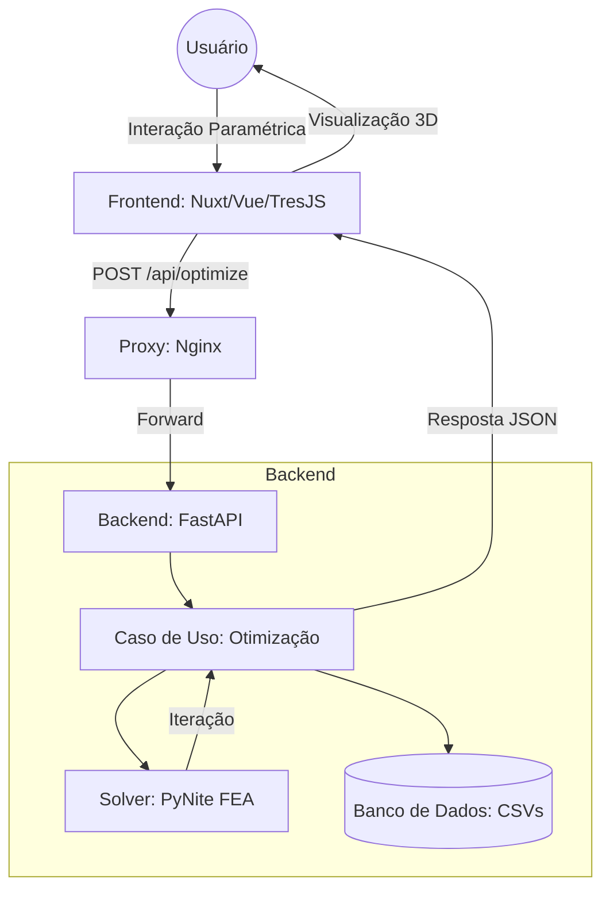
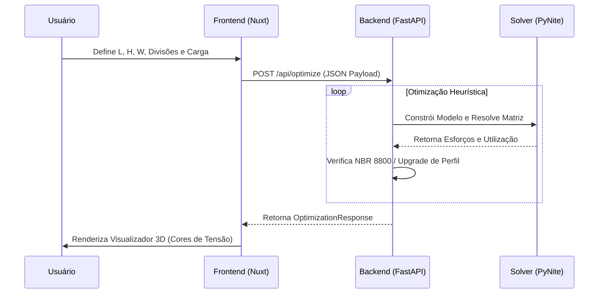
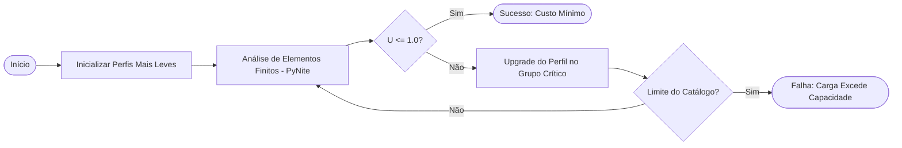

# TRUSS-OPT 3D: Sistema Computacional para Dimensionamento e Otimização Paramétrica de Treliças Espaciais

- **Instituição:** Universidade Estadual Vale do Acaraú (UVA)
- **Curso:** Bacharelado em Engenharia Civil
- **Disciplina:** Métodos Numéricos
- **Autor:** Paulo Raí Lopes de Melo
- **Professor:** Prof. Audelis Marcelo
- **Semestre:** 2026/01

---

## Descrição Geral do Software

O TRUSS-OPT 3D (Truss Optimizer 3D, ou Otimizador de Treliças 3D) é um sistema computacional voltado à engenharia civil, focado no dimensionamento e na otimização paramétrica de treliças espaciais.

O software foi desenvolvido para resolver um problema clássico de engenharia: encontrar o equilíbrio ideal entre a segurança estrutural e a viabilidade econômica. O sistema analisa estruturas submetidas a esforços, buscando minimizar o peso próprio e o custo total de fabricação por meio da seleção automatizada da seção transversal mais leve que consiga resistir às cargas solicitantes, sem violar os limites normativos de resistência e estabilidade.

## Características e Funcionalidades Técnicas

- **Design paramétrico e customizado:** Permite a geração topológica flexível, adaptando dimensões (vão, altura, largura e número de divisões) para a formulação de pórticos reticulados e treliças, além de suportar geometrias personalizadas.
- **Visualização 3D de esforços e tensões em tempo real:** A interface reativa renderiza o modelo tridimensional com mapeamento em gradiente, destacando peças sob tração e compressão para facilitar a análise visual do comportamento elástico.
- **Otimização baseada em catálogo discreto:** O núcleo do software utiliza algoritmos de busca para iterar sobre um banco de dados real e comercial de perfis tubulares, refinando a estrutura grupo a grupo até alcançar a eficiência máxima.

## Fundamentação Teórica e Modelagem Estrutural

O núcleo de cálculo é fundamentado em princípios avançados da mecânica dos sólidos e cálculo numérico:

- **Aplicação do Método dos Elementos Finitos (MEF):** A matriz de rigidez global da estrutura é montada e invertida computacionalmente para a obtenção dos deslocamentos nodais e, consequentemente, das reações e esforços axiais internos de cada membro.
- **Definição das Condições de Contorno e Graus de Liberdade:** Os nós são submetidos a restrições que simulam os apoios físicos, permitindo graus de liberdade para translação e rotação. O sistema suporta apoios rotulados, engastes perfeitos e apoios elásticos.
- **Distribuição de Carregamentos:** O cálculo de superposição considera o somatório da carga permanente (peso próprio distribuído em todos os nós baseado no comprimento e densidade do perfil) e do carregamento externo variável, distribuído nas faces superiores da treliça.
- **Critérios de Verificação normativa (NBR 8800 e NBR 14762):** A avaliação do Estado Limite Último (ELU) determina a taxa de utilização ($U$), garantindo que $U \le 1.0$.
- **Estados Limites Últimos (Escoamento e Flambagem Global):**
  Para forças de tração ($N_t$), verifica-se o escoamento da área bruta:
  $$N_{t,Rd} = A \cdot f_y$$
  Para peças sob compressão ($N_c$), leva-se em conta a redução da resistência devido à instabilidade elástica de Euler, aplicando-se o índice de esbeltez global ($\lambda_0$) e o fator de redução ($\chi$):
  $$N_{c,Rd} = \chi \cdot A \cdot f_y$$

## Interação Solo-Estrutura (ISE)

A resposta estrutural real depende da rigidez da fundação subjacente, fator incorporado diretamente no modelo matricial:

- **Modelagem de apoios elásticos via Modelo de Winkler:** Fundações não são tratadas como fixas em terrenos deformáveis, mas acopladas a molas verticais ($K_z$) baseadas no coeficiente de reação do subleito ($k_{s1}$) obtido via ensaios de placa.
- **Correções Geométricas de Escala de Terzaghi:** O valor empírico de $k_{s1}$ é corrigido para as dimensões reais da sapata ($B$).
  Para solos granulares (areias):
  $$k_s = k_{s1} \cdot \left( \frac{B + 0.305}{2B} \right)^2$$
  Para solos coesivos (argilas):
  $$k_s = k_{s1} \cdot \left( \frac{0.305}{B} \right)$$
- **Rigidez Rotacional das Sapatas:** A rotação da base é penalizada por molas rotacionais ($K_{\theta x}$ e $K_{\theta z}$), calculadas pelo produto do coeficiente $k_s$ pelo momento de inércia da base da fundação ($I_x$ e $I_z$).

## Arquitetura do Sistema e Stack Tecnológico

A aplicação adota uma arquitetura cliente-servidor para isolar a visualização intensiva do cálculo matricial pesado.

- **Justificativa das Escolhas Tecnológicas:**
  A separação em microsserviços (Frontend paramétrico e Backend numérico) foi desenhada para não sobrecarregar a _thread_ principal do navegador com cálculos de álgebra linear, distribuindo as responsabilidades de forma otimizada.
  - **Backend (Motor Numérico e API):**
    - **Python:** A escolha do Python como linguagem base para o núcleo de cálculo justifica-se por sua maturidade no ecossistema de computação científica. A sintaxe facilita a transcrição de formulações matemáticas complexas e a integração com bibliotecas de resolução matricial.
    - **FastAPI:** Implementado para expor o _solver_ através de uma API REST. O FastAPI foi selecionado devido à sua extrema velocidade (comparável a Node e Go) e à integração nativa com o `Pydantic`, o qual garante uma validação estática rigorosa dos _payloads_ contendo as coordenadas geométricas e vetores de força submetidos pelo usuário.
    - **PyNite FEA e Pandas:** O `PyNite` é o motor principal para o Método dos Elementos Finitos, responsável por montar a matriz de rigidez global $[K]$ e solucionar o sistema linear de deslocamentos nodais $[K]\{D\} = \{F\}$. Em paralelo, o `Pandas` é utilizado para a manipulação vetorizada dos catálogos estáticos em `.csv`, garantindo buscas e comparações em tempo constante $O(1)$ durante a varredura do algoritmo heurístico.

  - **Frontend (Interface Gráfica e WebGL):**
    - **Vue.js e Nuxt 3:** O framework Vue.js (via _Composition API_) fornece a reatividade necessária para que as atualizações de dados paramétricos reflitam instantaneamente na interface de usuário. O Nuxt foi adotado como infraestrutura arquitetônica para organizar o roteamento de componentes estruturais e gerenciar os estados de forma padronizada.
    - **TresJS (Three.js):** Para a visualização dos resultados tridimensionais, adotou-se o `TresJS`, uma biblioteca que constrói componentes WebGL declarativos sobre o `Three.js` de forma nativa ao ecossistema Vue. Essa tecnologia permite renderizar a estrutura com alta taxa de quadros por segundo e mapear dinamicamente os gradientes de tensões normais ($\sigma$), colorindo as barras em tempo real com base nos diagramas de tração e compressão retornados pelo _solver_ numérico.

- **Fluxo de dados:** A interface web monta um payload JSON com as propriedades geométricas, os dados de carregamento e o perfil do solo. O `FastAPI` intercepta essa solicitação, realiza a iteração do catálogo, inverte as matrizes e devolve uma resposta final contendo nós otimizados e malha geométrica, a qual é processada de volta para o cliente para renderização 3D.

## Catálogo Paramétrico e Banco de Dados (CSV)

O processo estocástico de otimização consulta arquivos formatados que representam a disponibilidade real de suprimentos de construção civil:

- **Explicação do `profiles.csv`:** Mapeia perfis tubulares quadrados em aço ou alumínio (SHS). O catálogo fornece, para cada elemento, as propriedades vitais como Área ($A$), Momento de Inércia ($I_x$) e peso linear, que fundamentam o peso da estrutura e os raios de giração usados nas formulações da NBR 8800.

| Name             | Area     | Ix          | Weight | Yield     |
| :--------------- | :------- | :---------- | :----- | :-------- |
| SHS 40x40x2.5    | 0.000375 | 0.000000084 | 2.94   | 250000000 |
| SHS 50x50x3.0    | 0.000564 | 0.000000201 | 4.43   | 250000000 |
| SHS 60x60x3.0    | 0.000684 | 0.000000361 | 5.37   | 250000000 |
| SHS 75x75x4.0    | 0.001140 | 0.000000958 | 8.92   | 250000000 |
| SHS 90x90x4.5    | 0.001540 | 0.000001880 | 12.10  | 250000000 |
| SHS 100x100x5.0  | 0.001900 | 0.000002870 | 14.90  | 250000000 |
| SHS 120x120x6.0  | 0.002740 | 0.000006090 | 21.50  | 250000000 |
| SHS 150x150x8.0  | 0.004540 | 0.000015100 | 35.70  | 250000000 |
| SHS 200x200x10.0 | 0.007600 | 0.000045300 | 59.70  | 250000000 |

- **Explicação do `materials.csv`:** Define o aspecto metalúrgico e econômico. Fornece o módulo de elasticidade ($E$), tensão de escoamento ($f_y$), tensão de ruptura ($f_u$), densidade volumétrica e custo mercadológico ($R\$/kg$) para diversas ligas (Aço A36, Aço Corten, Alumínio 6061-T6, etc).

| Material         | fy_MPa | fu_MPa | E_GPa | density_kgm3 | cost_BRL_kg |
| :--------------- | :----- | :----- | :---- | :----------- | :---------- |
| Aço A36          | 250    | 400    | 200   | 7850         | 8.45        |
| Aço A572 G50     | 345    | 450    | 200   | 7850         | 12.95       |
| Aço Corten       | 300    | 400    | 200   | 7850         | 10.00       |
| Alumínio 6061-T6 | 240    | 290    | 70    | 2800         | 65.00       |

## Lógica da Otimização Heurística de Custo-Benefício

O método não se restringe à viabilidade unicamente técnica, priorizando as finanças do projeto:

- **O processo de busca:** A rotina inicia atribuindo a menor seção transversal de catálogo a todos os grupos (banzos, montantes, diagonais). Ao avaliar a matriz de utilização, se o membro mais sobrecarregado de um grupo exceder o índice de projeto ($U > 1.0$), o algoritmo sobe a classe do perfil exclusivamente para aquele grupo. Esse ciclo se repete heuristicamente até a convergência estática.

- **Restrições de homogeneidade de materiais:** A avaliação do menor custo itera sobre a malha das opções estruturais de materiais uma liga por vez. Ou seja, compara-se o menor custo resultante de uma treliça montada exclusivamente de Alumínio contra uma fabricada inteiramente em Aço A36, mantendo a homogeneidade química e arquitetônica da obra.

## Cenários de Simulação e Validação

Durante a elaboração da modelagem, foram garantidas baterias de testes com predições numéricas:

- **Baixa Carga:** Demonstra convergência rápida para os perfis iniciais do banco de dados (ex: SHS 40x40), destacando que a taxa limite nestes cenários fica restrita apenas aos estados limites de esbeltez excessiva.
- **Carga Crítica:** Aumentos de carga vertical ativam o ciclo máximo da heurística, demandando upgrades contínuos do catálogo para SHS pesados (ex: SHS 200x200) visando mitigar flechas e evitar as falhas do pórtico por escoamento.
- **Diferentes tipos de solo:** Apoios em rocha sólida fornecem matrizes de deslocamento restritas, enquanto a seleção de terrenos como "Argila Mole" (com baixo $k_{s1}$) propaga recalques nodais pelas molas de Winkler, afetando toda a distribuição e induzindo perfis mais robustos.
- **Análise de comportamento esperado (Alumínio x Aço):** A validação confirma que ligas como o Alumínio, possuindo um Módulo de Elasticidade ($E \approx 70 \text{ GPa}$) inferior ao aço ($E \approx 200 \text{ GPa}$), apresentam altos níveis de falha prematura não por ruptura à tração, mas por conta da instabilidade elástica (flambagem acentuada sob compressão).

## Guia de Instalação

O sistema pode ser instalado facilmente:

- **Requisitos do sistema:**
  - Docker Desktop (versão 24.0 ou superior)
  - Python 3.11+
  - Node.js v20+

- **Instalação via Docker Compose (Recomendado):**
  Todo o ambiente com proxy reverso pode ser isolado através do motor de orquestração:
  1. No diretório raiz, execute: `docker compose up --build`
  2. Acesse no navegador local: `http://localhost:3000`

- **Instalação Manual:**
  - **Backend:** Acesse a pasta `/backend`, execute `pip install -r requirements.txt` e inicie com `uvicorn api.main:app --reload`.
  - **Frontend:** Acesse a pasta `/frontend`, instale as bibliotecas com `npm install` e processe o servidor de desenvolvimento utilizando `npm run dev`.

## Acesso à Aplicação em Produção

O software encontra-se compilado em nuvem e disponível de forma pública para interações de teste.

- **Link direto para o deploy:** [https://trussopt3d.onrender.com](https://trussopt3d.onrender.com)
