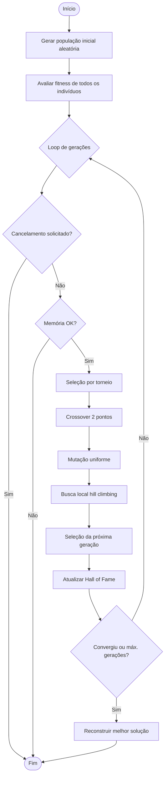
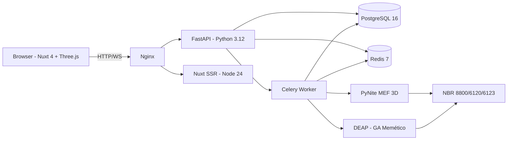
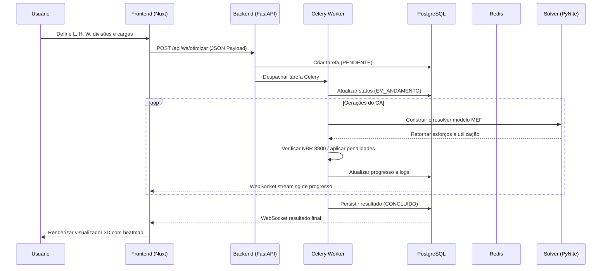

# TRUSS-OPT 3D: Sistema Computacional para Dimensionamento e Otimização Paramétrica de Treliças Espaciais

> **Instituição:** Universidade Estadual Vale do Acaraú (UVA)
> **Curso:** Bacharelado em Engenharia Civil
> **Disciplina:** Métodos Numéricos
> **Autor:** Paulo Raí Lopes de Melo
> **Professor:** Prof. Audelis Marcelo
> **Semestre:** 2026/01

O TRUSS-OPT 3D (Truss Optimizer 3D, Otimizador de Treliças 3D) é um sistema computacional voltado à engenharia civil, focado no dimensionamento e na otimização paramétrica de treliças espaciais via Algoritmo Genético Memético, com verificação automática das normas brasileiras NBR 8800:2008 (estruturas de aço), NBR 6120 (cargas em edificações) e NBR 6123:1988 (vento em edificações). O sistema foi desenvolvido para resolver um problema clássico de engenharia: encontrar o equilíbrio ideal entre a segurança estrutural e a viabilidade econômica, minimizando o custo total de fabricação por meio da seleção automatizada da seção transversal mais leve e mais barata que consiga resistir às cargas solicitantes, sem violar os limites normativos de resistência e estabilidade.

> **Aviso legal:** Esta ferramenta é destinada a fins educacionais e de pré-dimensionamento. Projetos reais devem ser validados por engenheiro civil habilitado e seguem os textos originais das normas ABNT.

## Sumário

- [1. Descrição Geral](#1-descricao-geral)
- [2. Fundamentação Teórica e Modelagem Estrutural](#2-fundamentacao-teorica-e-modelagem-estrutural)
  - [2.1 Método dos Elementos Finitos (MEF)](#21-metodo-dos-elementos-finitos-mef)
  - [2.2 Verificações Normativas](#22-verificacoes-normativas)
  - [2.3 Interação Solo-Estrutura (ISE)](#23-interacao-solo-estrutura-ise)
  - [2.4 Algoritmo Genético Memético](#24-algoritmo-genetico-memetico)
- [3. Arquitetura do Sistema e Stack Tecnológico](#3-arquitetura-do-sistema-e-stack-tecnologico)
- [4. Catálogo de Materiais e Perfis](#4-catalogo-de-materiais-e-perfis)
- [5. API REST](#5-api-rest)
- [6. Frontend](#6-frontend)
- [7. Memorial de Cálculo](#7-memorial-de-calculo)
- [8. Cenários de Simulação e Validação](#8-cenarios-de-simulacao-e-validacao)
- [9. Instalação e Execução](#9-instalacao-e-execucao)
- [10. Variáveis de Ambiente](#10-variaveis-de-ambiente)
- [11. Testes](#11-testes)
- [12. Licença](#12-licenca)
- [13. Referências](#13-referencias)

## 1. Descrição Geral

O software permite ao usuário:

- Selecionar entre 9 topologias paramétricas de treliça (Pratt, Howe, Fink, Warren, torres quadradas e triangulares, balanços Pratt e Warren).
- Definir vão, altura, largura, número de painéis e carregamentos gravitacionais.
- Configurar parâmetros de vento conforme NBR 6123 (V0, S1, S2, S3, Ce, Ci).
- Restringir o espaço de busca do otimizador (materiais, famílias de perfis, perfis específicos).
- Executar a otimização assíncrona (Celery + Redis) sem bloquear a interface.
- Visualizar a estrutura 3D com heatmap de tensões e deformada amplificada.
- Inspecionar cada barra individualmente (força axial, taxa de utilização, fator chi, fator Q, índice de esbeltez).
- Exportar memorial de cálculo em PDF ou DOCX com referências às equações NBR utilizadas.

### 1.1 Características Técnicas

- **Design paramétrico e customizado:** Geração topológica flexível, adaptando dimensões (vão, altura, largura e número de divisões) para a formulação de pórticos reticulados e treliças, além de suportar geometrias personalizadas via coordenadas individuais dos nós.
- **Visualização 3D de esforços e tensões em tempo real:** A interface reativa renderiza o modelo tridimensional com mapeamento em gradiente contínuo (azul para verde, amarelo e vermelho), destacando peças sob tração e compressão para facilitar a análise visual do comportamento elástico.
- **Otimização baseada em catálogo discreto:** O núcleo do software utiliza um Algoritmo Genético Memético para iterar sobre um banco de dados real de perfis comerciais (cantoneiras L, tubos RHS, perfis U enrijecido Ue), refinando a estrutura grupo a grupo até alcançar a eficiência máxima de custo.

## 2. Fundamentação Teórica e Modelagem Estrutural

### 2.1 Método dos Elementos Finitos (MEF)

O núcleo de cálculo é fundamentado em princípios da mecânica dos sólidos e cálculo numérico. A matriz de rigidez global da estrutura é montada e invertida computacionalmente para a obtenção dos deslocamentos nodais e, consequentemente, das reações e esforços axiais internos de cada membro.

$$[K]\{D\} = \{F\}$$

Os nós são submetidos a restrições que simulam os apoios físicos, permitindo graus de liberdade para translação e rotação. O sistema suporta apoios rotulados (Pinned), engastes perfeitos (Fixed), apoios de rolete (Roller) e apoios elásticos (modelo de Winkler). O cálculo de superposição considera o somatório da carga permanente (peso próprio distribuído em todos os nós baseado no comprimento e densidade do perfil) e do carregamento externo variável, distribuído nas faces superiores da treliça.

### 2.2 Verificações Normativas

A avaliação do Estado Limite Último (ELU) determina a taxa de utilização U, garantindo U <= 1.0 para todas as combinações de carregamento.

#### NBR 8800:2008 (Estruturas de Aço)

**Esbeltez máxima:** O índice de esbeltez λ é limitado a 200 para peças comprimidas (Item 5.3.4.1) e 300 para peças tracionadas (Item 5.2.8.1). O comprimento de flambagem Lk é obtido por varredura de grafo, diferenciando o plano da treliça (Lk = L) do plano fora da treliça (Lk = L para banzos).

**Flambagem local (Fator Q):** Conforme Anexo F da NBR 8800, para seções com relação b/t superior ao limite λr, aplica-se o fator de redução Q obtido pelo método da largura efetiva.

**Flambagem global (Fator χ):** A força axial resistente de compressão é calculada por:

$$N_{c,Rd} = \frac{\chi \cdot Q \cdot A \cdot f_y}{\gamma_{a1}}$$

O índice de esbeltez reduzido λ0 é:

$$\lambda_0 = \sqrt{\frac{Q \cdot A \cdot f_y}{N_e}}$$

Com N_e = min(N_ex, N_ey) sendo a carga crítica de Euler no menor eixo de inércia:

$$N_{ex} = \frac{\pi^2 E I_x}{(k_x L_x)^2} \qquad N_{ey} = \frac{\pi^2 E I_y}{(k_y L_y)^2}$$

O fator de redução χ é obtido por:

$$\chi = 0{,}658^{\lambda_0^2} \quad \text{se } \lambda_0 \leq 1{,}5$$

$$\chi = \frac{0{,}877}{\lambda_0^2} \quad \text{se } \lambda_0 > 1{,}5$$

**Força axial resistente à tração:**

$$N_{t,Rd} = \frac{A \cdot f_y}{\gamma_{a1}}$$

**Momento fletor resistente (regime elástico):**

$$M_{Rd} = \frac{W \cdot f_y}{\gamma_{a1}}$$

**Interação N+M (Item 5.5.1.2):** Para barras submetidas à flexocompressão:

$$\frac{N_{Sd}}{N_{Rd}} + \frac{8}{9} \cdot \frac{M_{Sd}}{M_{Rd}} \leq 1{,}0 \quad \text{se } \frac{N_{Sd}}{N_{Rd}} \geq 0{,}2$$

$$\frac{N_{Sd}}{2 N_{Rd}} + \frac{M_{Sd}}{M_{Rd}} \leq 1{,}0 \quad \text{se } \frac{N_{Sd}}{N_{Rd}} < 0{,}2$$

**Estado Limite de Serviço (ELS):** A flecha máxima é verificada em relação ao limite L/250 para combinações frequentes, conforme NBR 8800 Item 5.5.3.

#### NBR 6120 (Ações em Edificações)

As cargas variáveis mínimas seguem a NBR 6120 Item 6.4 (0,25 a 0,50 kN/m² conforme inclinação da cobertura). Uma carga de manutenção de 1 kN concentrado é aplicada isoladamente em cada nó do banzo superior. Casos assimétricos são gerados automaticamente (meia carga esquerda, meia direita e nós alternados). A verificação de empoçamento progressivo segue o Anexo D da norma. As combinações ELU seguem a NBR 8681 (Normal, Secundário, Alívio, Sem Vento, Vento Dominante), e as combinações ELS contemplam Flecha Total, Frequente e Quase permanente.

#### NBR 6123:1988 (Vento em Edificações)

A velocidade característica do vento é:

$$V_k = V_0 \cdot S_1 \cdot S_2 \cdot S_3$$

A pressão dinâmica é:

$$q = 0{,}613 \cdot V_k^2 \quad (\text{N/m}^2)$$

A força por elemento é $F = (C_e - C_i) \cdot q \cdot A_s$, aplicada tridimensionalmente: forças verticais no banzo superior (sucção), forças horizontais nas fachadas e força de arrasto global $F_a = C_a \cdot q \cdot A_e$. O ângulo de incidência do vento (0° a 345°) é decomposto em componentes nos eixos X e Z.

### 2.3 Interação Solo-Estrutura (ISE)

A resposta estrutural real depende da rigidez da fundação subjacente, fator incorporado diretamente no modelo matricial por meio de molas elásticas (modelo de Winkler).

**Modelagem de apoios elásticos:** O coeficiente de reação do subleito k_s1 é obtido empiricamente por tipo de solo. O sistema suporta seis tipos de solo predefinidos (Areia Fofa, Areia Compacta, Argila Mole, Argila Rija, Rocha e Customizado).

Para solos granulares (areias), aplica-se a correção geométrica de Terzaghi:

$$k_s = k_{s1} \cdot \left( \frac{B + 0{,}305}{2B} \right)^2$$

Para solos coesivos (argilas):

$$k_s = k_{s1} \cdot \left( \frac{0{,}305}{B} \right)$$

A rotação da base é penalizada por molas rotacionais $K_{\theta x}$ e $K_{\theta z}$, calculadas pelo produto do coeficiente $k_s$ pelo momento de inércia da base da fundação ($I_x$ e $I_z$).

### 2.4 Algoritmo Genético Memético

O otimizador implementa um Algoritmo Genético Memético (MA), combinando exploração global via GA com refinamento local via hill climbing com aprendizado Lamarckiano.

#### 2.4.1 Codificação

Cada indivíduo é um vetor de inteiros $[g_0, g_1, ..., g_N]$, onde cada posição representa o índice do perfil no catálogo PostgreSQL para um grupo estrutural (Banzo Superior, Banzo Inferior, Diagonal, Montante etc). As variáveis são discretas, o que garante soluções fabricáveis a partir de perfis comerciais reais.

#### 2.4.2 Função Objetivo

O GA minimiza o custo total em reais (R$), não apenas o peso:

$$f(\mathbf{x}) = W(\mathbf{x}) \cdot c_{kg} + \sum_{i} p_i$$

Onde $W(\mathbf{x})$ é o peso total da estrutura em kg, $c_{kg}$ é o custo unitário do material (R$/kg), e as penalidades $p_i$ são:

1. Violação normativa NBR 8800 (ELU): R$ 1e6 $\cdot (U - 1{,}0)$ para cada barra com $U > 1{,}0$.
2. Violação de flecha (ELS): R$ 1e6 $\cdot$ (excesso) se flecha $> L/250$.
3. Penalidade de padronização: R$ 5e3 $\cdot$ (excesso) se o número de perfis distintos exceder o limite configurado ($AG\_MAX\_PERFIS\_DISTINTOS$).

#### 2.4.3 Fase Genética (Exploração Global)

| Operador | Método | Parâmetro |
|----------|--------|-----------|
| Seleção | Torneio (k=3) | AG_INDICE_TORNEIO |
| Crossover | 2 pontos (cxTwoPoint) | AG_PROBABILIDADE_CRUZAMENTO (0,7) |
| Mutação | Uniforme inteira (mutUniformInt, indpb=1/N) | AG_PROBABILIDADE_MUTACAO (0,15) |
| Elitismo | Hall of Fame (top 1) | Sempre preserva o melhor |

#### 2.4.4 Fase Memética (Refinamento Local)

A cada geração, após a variação genética, os melhores aproximadamente 30% dos indivíduos passam por uma busca local hill climbing first-improvement com reinício:

```
Para cada grupo no indivíduo:
  1. Tentar perfil imediatamente mais leve (índice -1)
  2. Se melhorar o custo, manter e reiniciar varredura
  3. Senão, tentar perfil imediatamente mais pesado (índice +1)
  4. Se melhorar, manter e reiniciar varredura
  5. Senão, passar ao próximo grupo
Repetir até nenhuma troca unitária melhorar o fitness
```

Características do algoritmo memético:

- Aprendizagem Lamarckiana: o cromossomo é atualizado com a solução melhorada.
- Cache de avaliação: combinações de perfis já avaliadas na mesma execução são reutilizadas, evitando análises MEF redundantes.
- Direção bidirecional: diferente do algoritmo guloso original (que só subia perfis), o hill climbing pode subir ou descer, escapando de superdimensionamentos.
- Controlável via AG_USAR_REFINAMENTO_LOCAL (padrão true). Desative para usar GA puro.


```mermaid
flowchart TD
    Start([Início]) --> Init[Gerar população inicial aleatória]
    Init --> Eval[Avaliar fitness de todos os indivíduos]
    Eval --> GenLoop{Loop de gerações}
    GenLoop --> Cancel{Cancelamento solicitado?}
    Cancel -->|Sim| End([Fim])
    Cancel -->|Não| MemCheck{Memória OK?}
    MemCheck -->|Não| End
    MemCheck -->|Sim| Select[Seleção por torneio]
    Select --> Crossover[Crossover 2 pontos]
    Crossover --> Mutation[Mutação uniforme]
    Mutation --> LS[Busca local hill climbing]
    LS --> SelPop[Seleção da próxima geração]
    SelPop --> Hall[Atualizar Hall of Fame]
    Hall --> Conv{Convergiu ou máx. gerações?}
    Conv -->|Não| GenLoop
    Conv -->|Sim| Best[Reconstruir melhor solução]
    Best --> End
```

#### 2.4.5 Cancelamento e Proteção de Memória

O CanceladorOtimizacao permite abortar a otimização via API entre gerações. O verificador de memória lança LimiteMemoriaExcedido se a RAM do container exceder o percentual configurado (padrão 85%).

## 3. Arquitetura do Sistema e Stack Tecnológico

A aplicação adota uma arquitetura cliente-servidor com processamento assíncrono para isolar a visualização intensiva do cálculo matricial pesado.


```mermaid
flowchart LR
    A[Browser - Nuxt 4 + Three.js] -->|HTTP/WS| B[Nginx]
    B --> C[FastAPI - Python 3.12]
    B --> D[Nuxt SSR - Node 24]
    C --> E[(PostgreSQL 16)]
    C --> F[(Redis 7)]
    C --> G[Celery Worker]
    G --> E
    G --> F
    G --> H[PyNite MEF 3D]
    G --> I[DEAP - GA Memético]
    H --> J[NBR 8800/6120/6123]
    I --> J
```

### 3.1 Princípios Arquiteturais

- **Feature-based:** cada responsabilidade tem seu próprio diretório (api/, engineering/, optimization/, worker/, db/).
- **Assíncrono:** tarefas CPU-bound (MEF + GA) rodam em processo Celery separado.
- **Stateless API:** FastAPI não mantém estado entre requisições; tudo é persistido em PostgreSQL e Redis.
- **Cache determinístico:** payloads idênticos reaproveitam resultados via hash SHA-256 em Redis.
- **Memória protegida:** o GA aborta graciosamente se a RAM do container exceder 85% do limite.

### 3.2 Fluxo de Dados

O usuário interage com o frontend Nuxt, que envia um payload JSON com as propriedades geométricas, os dados de carregamento e o perfil do solo via WebSocket. O FastAPI cria uma tarefa no banco de dados e a despacha para o worker Celery, que executa o algoritmo genético memético resolvendo o modelo MEF a cada avaliação. O progresso é transmitido em tempo real para o frontend via WebSocket. Ao concluir, o resultado é persistido e enviado ao cliente.


```mermaid
sequenceDiagram
    participant U as Usuário
    participant F as Frontend (Nuxt)
    participant B as Backend (FastAPI)
    participant C as Celery Worker
    participant D as PostgreSQL
    participant R as Redis
    participant S as Solver (PyNite)

    U->>F: Define L, H, W, divisões e cargas
    F->>B: POST /api/ws/otimizar (JSON Payload)
    B->>D: Criar tarefa (PENDENTE)
    B->>C: Despachar tarefa Celery
    C->>D: Atualizar status (EM_ANDAMENTO)
    Loop Gerações do GA
        C->>S: Construir e resolver modelo MEF
        S-->>C: Retornar esforços e utilização
        C->>C: Verificar NBR 8800 / aplicar penalidades
        C->>D: Atualizar progresso e logs
        D-->>F: WebSocket streaming de progresso
    end
    C->>D: Persistir resultado (CONCLUIDO)
    D-->>F: WebSocket resultado final
    F->>U: Renderizar visualizador 3D com heatmap
```

### 3.3 Stack Tecnológica

| Camada | Tecnologia |
|--------|-----------|
| Frontend | Nuxt 4 + Vue 3.5 + TypeScript |
| Visualização 3D | Three.js via @tresjs/core + @tresjs/cientos |
| Estado | Pinia 3 |
| Estilos | Tailwind CSS 3.4 |
| Backend | FastAPI 0.115 + Pydantic 2.10 |
| Servidor ASGI | Uvicorn (1 worker) |
| Banco de Dados | PostgreSQL 16 |
| ORM | SQLAlchemy 2.0 |
| Broker e Cache | Redis 7 |
| Fila de Tarefas | Celery 5.4 (1 processo por worker) |
| MEF | PyniteFEA 3.0 |
| Otimização | DEAP 1.4 (Algoritmo Genético) |
| Relatórios | ReportLab 4.2 (PDF) + python-docx 1.1 (DOCX) |
| Proxy Reverso | Nginx stable-alpine |
| Runtime | Python 3.12 + Node.js 24 |

### 3.4 Estrutura de Diretórios

```
truss-opt-3d/
  docker-compose.yml              (orquestração dos serviços)
  nginx/conf.d/default.conf       (proxy reverso)
  backend/                        (Python 3.12 FastAPI + Celery)
    api/                          (rotas REST, WebSocket, schemas Pydantic, memorial)
    core/                         (config, database, celery_app, cache, memoria)
    db/                           (modelos ORM: Material, Perfil, TarefaOtimizacao)
    engineering/                  (modelos físicos, solver FEA, normas NBR 8800/6120/6123)
    optimization/                 (algoritmo genético memético com DEAP)
    worker/                       (tarefa Celery de otimização)
    seed/                         (população inicial: 6 materiais + 32 perfis)
    tests/                        (25 testes pytest)
  frontend/                       (Node 24 Nuxt 4 + Three.js)
    components/                   (TrussViewer, TrussSidebar, LoadingOverlay, etc)
    stores/                       (Pinia: form, WebSocket, catálogos)
    composables/                  (useToast)
    types/                        (interfaces TypeScript)
    utils/                        (truss3d, trussGenerators)
```

## 4. Catálogo de Materiais e Perfis

O banco de dados PostgreSQL armazena 6 aços estruturais nacionais e 32 perfis comerciais, inseridos automaticamente na primeira inicialização. O otimizador seleciona o material de melhor custo benefício entre as opções disponíveis.

### 4.1 Materiais Estruturais

| Material | fy (MPa) | fu (MPa) | E (GPa) | Rho (kg/m³) | Custo (R$/kg) | Norma |
|----------|----------|----------|---------|-------------|---------------|-------|
| A36 | 250 | 400 | 200 | 7850 | 8,45 | ASTM A36 |
| A572-Gr50 | 345 | 450 | 200 | 7850 | 12,95 | ASTM A572 Gr.50 |
| MR250 | 250 | 400 | 200 | 7850 | 8,80 | NBR 8800 / NBR 7007 |
| MR350 | 350 | 450 | 200 | 7850 | 10,50 | NBR 8800 / NBR 7007 |
| SAC300 | 300 | 420 | 200 | 7850 | 9,70 | NBR 8800 |
| SAC350 | 350 | 420 | 200 | 7850 | 11,10 | NBR 8800 |

### 4.2 Perfis Comerciais

O catálogo contempla três famílias de perfis: cantoneiras de abas iguais (L, 10 perfis, uso em montantes e diagonais), tubos retangulares (RHS, 10 perfis, uso em banzos e montantes) e perfis U enrijecido (Ue, 12 perfis, uso em banzos de tesouras). Cada perfil possui área, momentos de inércia Ix e Iy, momento de inércia à torção J e dimensões nominais registrados no banco de dados.

## 5. API REST

### 5.1 Endpoints Principais

| Método | Rota | Descrição |
|--------|------|-----------|
| GET | /api/health | Health check |
| GET | /api/materiais | Lista materiais ativos |
| GET | /api/perfis?familia=RHS | Lista perfis (opcionalmente filtrados por família) |
| POST | /api/otimizar | Inicia otimização, retorna task_id |
| GET | /api/tarefas/{id} | Consulta status da tarefa por polling |
| POST | /api/tarefas/{id}/cancelar | Cancela tarefa em andamento |
| GET | /api/tarefas/{id}/memorial/{formato} | Download do memorial (pdf ou docx) |
| WS | /api/ws/otimizar | Streaming de progresso em tempo real |

### 5.2 Exemplo de Payload

```json
{
  "length": 12.0,
  "height": 2.5,
  "width": 2.0,
  "divisions": 6,
  "load_cases": [
    {"type": "G", "direction": "FY", "value": -20000.0},
    {"type": "Q", "direction": "FY", "value": -50000.0}
  ],
  "soil_type": "Rocha",
  "footing_b": 0.6,
  "footing_l": 0.6,
  "parametros_vento": {
    "v0_mps": 40.0, "s1": 1.0, "s2": 1.0, "s3": 1.0,
    "direcao_vento_graus": 0.0, "ce_externo": 0.8, "ci_interno": 0.0
  },
  "restricoes": {
    "familias_permitidas": ["RHS"],
    "usar_penalidade_diversidade": true
  },
  "ag_geracoes": 12,
  "ag_populacao": 20
}
```

## 6. Frontend

### 6.1 Visualização 3D

O componente TrussViewer usa @tresjs/core (wrapper Vue para Three.js) e oferece:

- Heatmap de tensões com gradiente contínuo (azul 0% a verde 50%, amarelo 80% e vermelho 100%).
- Modo deformada com amplificação visual dos deslocamentos nodais (fator 50x).
- Controles orbitais para rotação, zoom e pan.
- Seleção de barras: clique em qualquer barra para inspecionar detalhes no MemberDetailCard.
- Apoios simbólicos: cones (Pinned), bases (Roller), blocos (Fixed).

### 6.2 Painel de Controles

A sidebar (TrussSidebar) segue o fluxo natural de configuração: Geometria, Carregamento (com vento NBR 6123 colapsável), Fundação e Otimizador (com modo de desempenho e restrições avançadas). Todos os campos possuem tooltips explicativos com terminologia técnica e valores típicos.

### 6.3 Estado Global

A store Pinia (useTrussStore) centraliza o formulário reativo, o ciclo de vida do WebSocket, os catálogos carregados do backend e as ações de memorial. O progresso da otimização é exibido em tempo real com logs por material, barra de progresso global entre todos os materiais e painel expansível de gerações.

## 7. Memorial de Cálculo

O memorial é gerado sob demanda em /api/tarefas/{id}/memorial/{formato} e contém:

1. Dados de entrada (geometria, cargas, materiais, fundação).
2. Casos de carga aplicados conforme NBR 6120.
3. Combinações ELU e ELS conforme NBR 8681.
4. Tabela de esforços por barra: força axial N, momentos M, taxa de utilização U, fator chi, fator Q, índice de esbeltez lambda e status (ok ou falha).
5. Equações NBR 8800 utilizadas com referência ao item da norma.
6. Cargas de vento NBR 6123 (Vk, q, Ce, Ci).
7. Resultado da otimização: peso total, custo total, material vencedor, utilização máxima, flecha máxima e contraflecha.
8. Barras mais solicitadas (top 5 por taxa de utilização).

Formatos suportados: PDF (ReportLab) e DOCX (python-docx). O memorial é persistido em PostgreSQL (base64) para reuso.

## 8. Cenários de Simulação e Validação

Durante a elaboração da modelagem, foram conduzidas baterias de testes com predições numéricas:

- **Baixa Carga:** Convergência rápida para os perfis iniciais do banco de dados, com taxa limite restrita apenas aos estados limites de esbeltez excessiva.
- **Carga Crítica:** Aumentos de carga vertical ativam o ciclo completo do algoritmo memético, demandando perfis mais robustos para mitigar flechas e evitar falhas por escoamento ou flambagem.
- **Diferentes tipos de solo:** Apoios em rocha fornecem matrizes de deslocamento restritas, enquanto solos moles propagam recalques nodais pelas molas de Winkler, induzindo perfis mais robustos.
- **Comparação entre aços:** A validação confirma que aços de maior resistência (MR350, A572 Gr50) podem resultar em estruturas mais leves, mas o custo unitário mais elevado (R$ 10,50 a R$ 12,95/kg) faz com que o GA frequentemente prefira aços de resistência média com menor custo (MR250 a R$ 8,80/kg ou A36 a R$ 8,45/kg).

## 9. Instalação e Execução

### 9.1 Pré-requisitos

- Docker 24+ com Docker Compose v2+
- 4 GB de RAM disponível (recomendado)
- Git para clonar o repositório

### 9.2 Execução com Docker Compose (recomendado)

Clone o repositório e inicie todos os serviços:

```bash
git clone <url-do-repositorio>
cd truss-opt-3d
docker compose up --build -d
```

Na primeira execução, o banco de dados PostgreSQL é populado automaticamente com 6 materiais e 32 perfis (via `seed/popular_banco.py`).

Para acompanhar os logs:

```bash
docker compose logs -f backend worker
```

Para parar a aplicação:

```bash
docker compose down
```

Para aplicar alterações no código após modificar arquivos:

```bash
docker compose up -d --build
```

Isso reconstrói as imagens e reinicia apenas os containers alterados.

**Acessos após a inicialização:**

| Recurso | URL |
|---------|-----|
| Frontend (via Nginx) | http://localhost:80 |
| Frontend (direto) | http://localhost:3000 |
| Documentação da API (Swagger) | http://localhost:8000/docs |
| Health check | http://localhost:8000/api/health |

### 9.3 Desenvolvimento Local (sem Docker)

Para desenvolvimento, é necessário ter Python 3.12+, Node.js 24+ e Redis rodando localmente.

**Backend:**

```bash
cd backend
python -m venv .venv && source .venv/bin/activate
pip install -r requirements.txt
cp .env.example .env
# Edite .env se necessário (padrões apontam para localhost)
python -c "from seed.popular_banco import popular_banco; popular_banco()"
uvicorn api.main:app --reload --port 8000
```

Em outro terminal, inicie o worker Celery (requer Redis em execução):

```bash
celery -A core.celery_app worker --loglevel=info --concurrency=1
```

**Frontend:**

```bash
cd frontend
npm install
npm run dev
```

O servidor de desenvolvimento do Nuxt (porta 3000) faz proxy automático das requisições `/api` para o backend (porta 8000), não sendo necessário configurar CORS manualmente.

### 9.4 Primeiros Passos

Com a aplicação rodando, siga este roteiro rápido:

1. Acesse http://localhost:3000 no navegador.
2. Na sidebar, escolha um tipo de estrutura (ex: Tesoura Pratt).
3. Ajuste vão (12 m), altura (2,5 m) e número de painéis (6).
4. Em Carregamento, mantenha os valores padrão de carga permanente e sobrecarga.
5. Em Otimizador, selecione o modo de desempenho (Normal ou Rápido para testes).
6. Clique em "Iniciar Análise Estrutural".
7. Acompanhe o progresso em tempo real no painel de logs.
8. Ao finalizar, explore o resultado 3D: gire a câmera, clique em barras para inspecionar, e expanda o rodapé para ver todas as métricas.
9. Se desejar, baixe o memorial de cálculo em PDF ou Word.

## 10. Variáveis de Ambiente

Todas as variáveis são opcionais (têm defaults) e lidas via pydantic-settings:

| Variável | Default | Descrição |
|----------|---------|-----------|
| POSTGRES_HOST | postgres | Host do PostgreSQL |
| POSTGRES_USUARIO / POSTGRES_SENHA | truss | Credenciais do Postgres |
| POSTGRES_BANCO | truss_opt | Nome do banco |
| REDIS_HOST | redis | Host do Redis |
| CELERY_MAX_CONCORRENCIA | 1 | Processos por worker (MEF é CPU bound) |
| LIMITE_MEMORIA_PERCENTUAL | 85.0 | Aborta GA acima deste percentual de RAM |
| AG_POPULACAO_TAMANHO | 20 | Tamanho da população do GA |
| AG_GERACOES | 12 | Número de gerações |
| AG_PROBABILIDADE_CRUZAMENTO | 0.7 | Probabilidade de crossover |
| AG_PROBABILIDADE_MUTACAO | 0.15 | Probabilidade de mutação |
| AG_PENALIDADE_VIOLACAO_NORMATIVA | 1.0e6 | Penalidade por violação NBR (R$) |
| AG_PENALIDADE_DIVERSIDADE_PERFIS | 5.0e3 | Penalidade por perfis distintos extras (R$) |
| AG_MAX_PERFIS_DISTINTOS | 4 | Limite de perfis distintos antes de aplicar multa |
| AG_USAR_REFINAMENTO_LOCAL | true | Ativa busca local (algoritmo memético) |
| NBR_FLECHA_LIMITE | 250.0 | Divisor do vão para ELS (L/250) |
| NBR_ESBELTEZ_MAX_COMPRESSAO | 200.0 | Limite de lambda para compressão (NBR 8800 5.3.4.1) |
| NBR_ESBELTEZ_MAX_TRACAO | 300.0 | Limite de lambda para tração (NBR 8800 5.2.8.1) |

## 11. Testes

```bash
cd backend
pytest -v
```

Cobertura atual: 25 testes distribuídos em:

- test_nbr8800.py (9 testes): esbeltez, fator Q, chi, N_rd, interação N+M, flecha.
- test_nbr6120.py (8 testes): cargas de cobertura, manutenção, assimetrias, combinações, empoçamento.
- test_nbr6123.py (6 testes): Vk, q, decomposição de direção, área frontal, forças 3D.
- test_otimizacao_ga.py (2 testes): integração GA + solver com treliça simples.

Os testes usam SQLite em memória (via conftest.py) para não depender de PostgreSQL.

## 12. Licença

Distribuído sob licença MIT. Consulte o arquivo `LICENSE` para detalhes.

## 13. Referências

- ASSOCIAÇÃO BRASILEIRA DE NORMAS TÉCNICAS. NBR 8800: Projeto de estruturas de aço e de estruturas mistas de aço e concreto de edifícios. Rio de Janeiro, 2008.
- ASSOCIAÇÃO BRASILEIRA DE NORMAS TÉCNICAS. NBR 6120: Ações para o cálculo de estruturas de edificações. Rio de Janeiro, 2019.
- ASSOCIAÇÃO BRASILEIRA DE NORMAS TÉCNICAS. NBR 6123: Forças devidas ao vento em edificações. Rio de Janeiro, 1988.
- ASSOCIAÇÃO BRASILEIRA DE NORMAS TÉCNICAS. NBR 14762: Dimensionamento de estruturas de aço constituídas por perfis formados a frio. Rio de Janeiro, 2010.
- ASSOCIAÇÃO BRASILEIRA DE NORMAS TÉCNICAS. NBR 8681: Ações e segurança nas estruturas. Rio de Janeiro, 2003.
- FORTES, A. S. et al. Python FEA: PyNite. Biblioteca open-source para análise por elementos finitos.
- FORTIN, F. A. et al. DEAP: Evolutionary Algorithms Made Easy. Journal of Machine Learning Research, v. 13, p. 2171 2175, 2012.
- TERZAGHI, K. Theoretical Soil Mechanics. John Wiley and Sons, 1943.
- WINKLER, E. Die Lehre von der Elasticitaet und Festigkeit. Prag, 1867.
